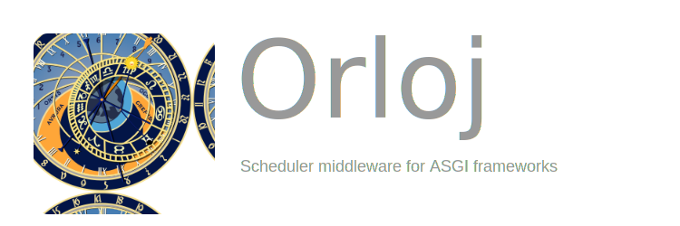

# Orloj

[](https://pypi.org/project/orloj)
[](https://pypi.org/project/orloj)
[](https://pypi.org/project/orloj)
[](.)
[](.)
[](.)
[](.)

[](static/orloj-banner.svg)

## Getting started

You can use `orloj` simply by installing via `pip` on your Terminal.

```sh
pip install orloj
```

or alternatively when using [poetry](https://python-poetry.org) package manager as such:

```sh
poetry add orloj
```

And then you can begin using `OrlojMiddleware` in your ASGI project as such

```python
...
from orloj import OrlojMiddleware

def action() -> None:
  """Action to be called by scheduler"""

app.add_middleware(OrlojMiddleware, interval=3, job=action)  # Schedules for 3 second interval
...
```

The following example shows you how to setup `OrlojMiddleware` to run scheduled tasks alongside
your [FastAPI](https://github.com/tiangolo/fastapi) application.

```python
from fastapi import FastAPI
from logging import Logger, getLogger
from orloj import OrlojMiddleware
from starlette.responses import PlainTextResponse, RedirectResponse

app = FastAPI()
logger: Logger = getLogger("uvicorn")

def hello_name(name: str) -> None:
  logger.info(f"Hello, {name}!")

def hello_world() -> None:
  logger.info("Hello, World!")

@app.get("/")
async def redirect_to_swagger_docs() -> RedirectResponse:
  """Redirects to swagger documentation
  """
  return RedirectResponse("/docs")

@app.get("/health", response_class=PlainTextResponse, status_code=200)
async def health() -> str:
  """Health check
  """
  return "OK"

app.add_middleware(OrlojMiddleware, interval=3, job=hello_name, name="Igor")
app.add_middleware(OrlojMiddleware, interval=6, job=hello_world)
```

## Dependencies

* [APScheduler](https://github.com/agronholm/apscheduler)
  [](https://pypi.org/project/APScheduler)
  [](https://apscheduler.readthedocs.io/en/3.x)

* [starlette](https://www.starlette.io)
  [](https://pypi.org/project/starlette)
  [](https://www.starlette.io)

## Contributions

To contribute to the project, fork the repository and clone to your local device and development
dependencies including three extra libraries not included in final builds as such:

* [black](https://github.com/psf/black) - The uncompromising Python code formatter 
* [mypy](https://github.com/python/mypy) - Optional static typing for Python
* [pytest](https://github.com/pytest-dev/pytest) - The pytest framework makes it easy to write small tests, yet scales to support complex functional testing

Use the following commands to setup your local environment with development dependencies:

```bash
pip install --user poetry
poetry install --with dev
```

## Acknowledgements

* [APScheduler Web Examples](https://github.com/agronholm/apscheduler/tree/master/examples/web)
* [Wikimedia Commons - File:Prague Astronomical Clock.svg](https://commons.wikimedia.org/wiki/File:Prague_Astronomical_Clock.svg)

## License

This project is licensed under the terms of the MIT license.